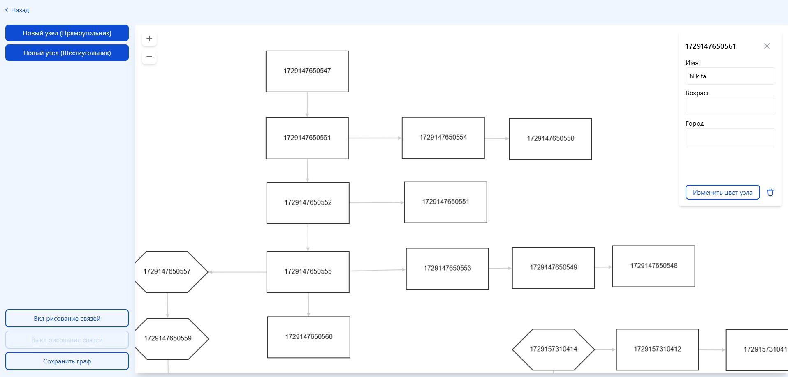
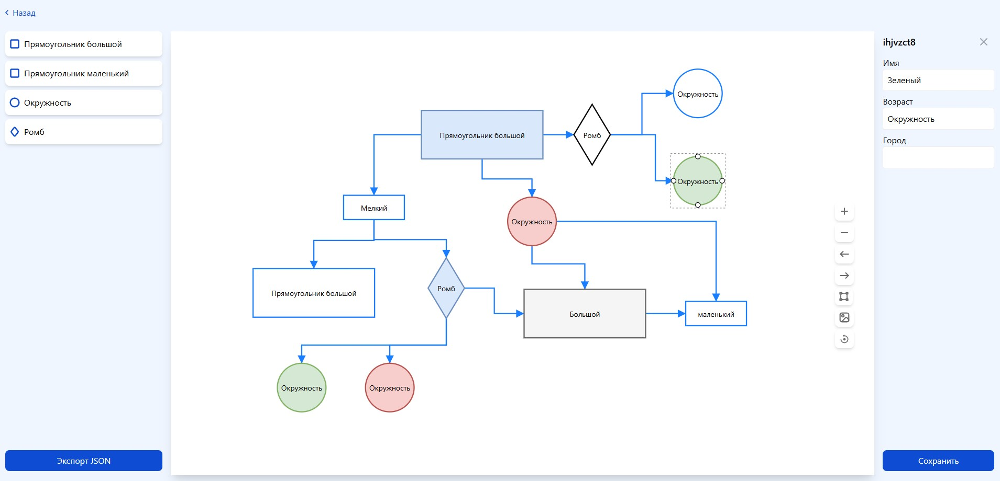
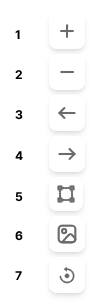

<h1 align="center">Анализ существующих библиотек для редактирования направленых ациклических графов</h1>
<h2 align="center"></h2>

## Пример реализации cytoscape

**ИНСТРУКЦИЯ ПО ФУНКЦИОНАЛУ**

- Для добавления нового узла любого типа необходимо нажать на необходимый тип и перенести в область графа
- Для рисования связей между узлами необходимо переключиться в необходимый режим - **"Вкл рисование связей"**. После необходимых дейсвтий его необходимо выключить.
- Для удаления связей между узлами требуется **двойной клик** на требуемую стрелку связи
- При нажатии на узел открывается окно с информацией, которая сохраняется автоматически
- В карточке также можно изменить цвет узла и удалить его
- При сохранении графа информация выводится в консоль браузера
- Для маштабирования графа можно пользоваться либо **ctrl+колесико мыши**, либо с помощью кнопок **+** и **-** на графе

## Пример реализации logicflow

**ИНСТРУКЦИЯ ПО ФУНКЦИОНАЛУ**

- Для добавления нового узла любого типа необходимо нажать на необходимый тип и перенести в область графа
- Рисование связей между узлами происходить в автоматическом режиме
- Для удаления связей между узлами необходимо навестить на стрелку, нажать правую кнопку мыши и из меню выбрать требуемое действие
- Для изменения заголовка блока необходимо дважды на него нажать. Изменения сохранятся автоматически
- При нажатии на узел открывается окно с информацией. Для сохранения данных необходимо нажать кнопку **"Сохранить"**
- Для изменения цвета узла или его удаления необходимо на него навестись, нажать правую кнопку мыши и выбрать необходимый пункт меню
- При экспорте графа информация выводится в консоль браузера

**Описание общего меню графа**

- 1 и 2 - маштабирование графа
- 3 и 4 - управление изменениями графа
- 5 - при нажатии активируется область для выделения сразу нескольких объектов. Отключается автоматически
- 6 - экспорт графа в формате png
- 7 - центровка графа (центруется относительно начального положения) 
